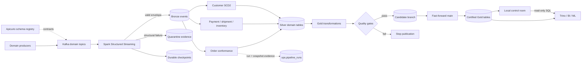
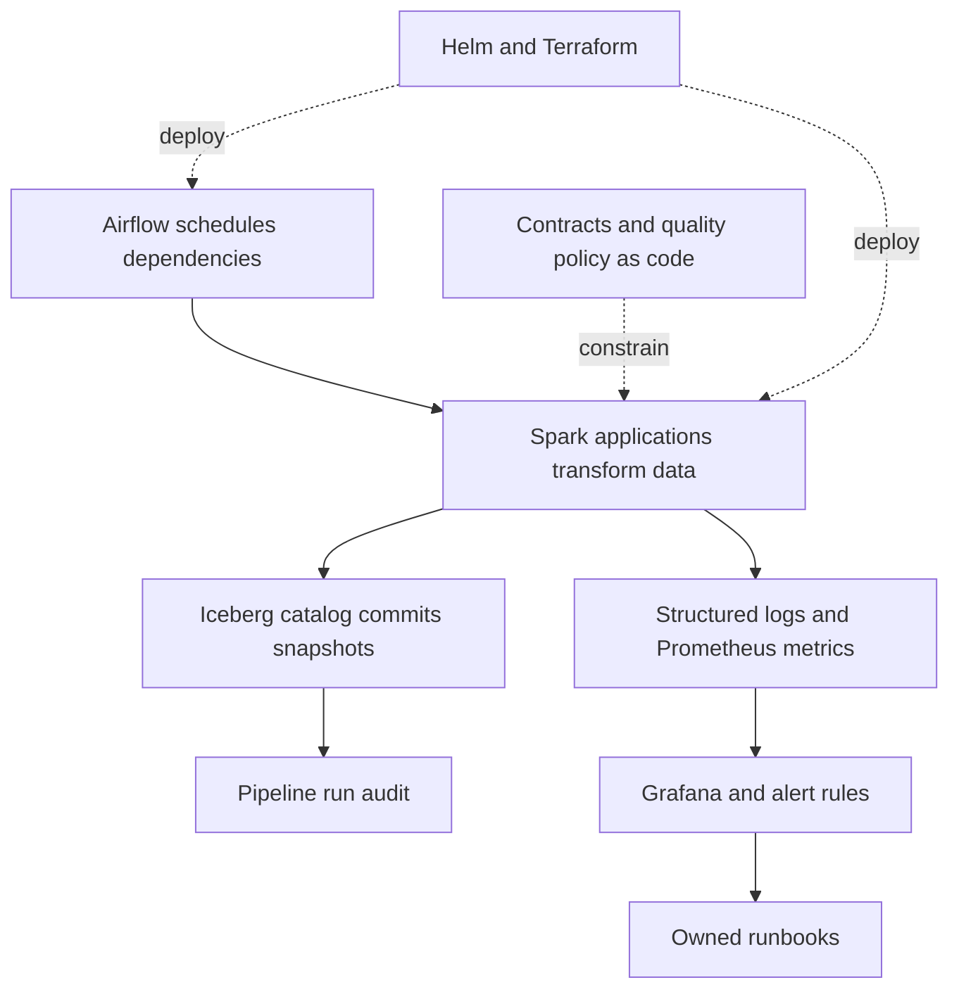
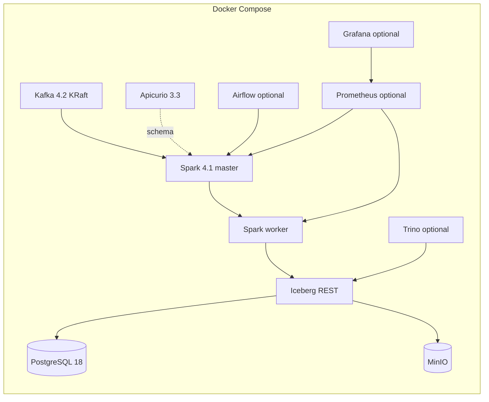
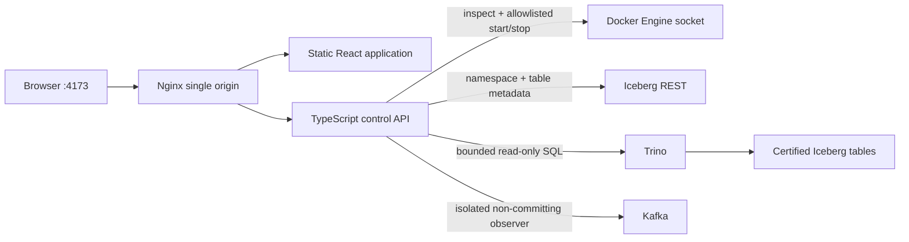

# Marketplace Lakehouse

A production-oriented Apache Spark and Apache Iceberg reference platform for marketplace event
data. It demonstrates how to move from versioned domain events to replayable evidence, deterministic
domain state, and atomically published analytical products without hiding the operational controls
needed between those stages.

This repository contains three complementary deliverables:

1. An executable local lakehouse that runs end to end on synthetic data with Docker Compose.
2. A production deployment reference containing Airflow orchestration, Kubernetes/Spark Operator
   resources, Terraform, monitoring rules, runbooks, and release evidence requirements.
3. A localhost operations dashboard for service health and lifecycle control, Iceberg catalog
   discovery, certified metric visualization, and bounded read-only Trino queries.

The local system is deliberately compact. It preserves the important data contracts, state
boundaries, failure paths, and publication semantics, but it is not presented as a production-sized
cluster or proof of a production SLA.

## Why this project exists

Marketplace data arrives independently from order, payment, inventory, shipment, and customer
systems. Delivery may be duplicated or late, producer payloads can be malformed, and downstream
analytics must not observe partially refreshed datasets. A credible platform therefore needs more
than a sequence of transformations: it needs evidence, deterministic replay, quality ownership,
atomic publication, and a recoverable state model.

This implementation focuses on those platform concerns:

- schema-governed domain event ingestion;
- durable source-position and malformed-record evidence;
- deterministic, idempotent conformance;
- customer history using SCD Type 2 semantics;
- quality-gated analytical publication through Iceberg branches;
- an operational audit schema and recorded Silver order run evidence;
- bounded backfill and safe table maintenance;
- local observability and a hardened Kubernetes deployment reference.

## Scope

### Implemented and executable

- Five Kafka topics for orders, payments, inventory, shipments, and customer CDC.
- Avro and JSON event-envelope decoding with contract compatibility policy.
- Spark Structured Streaming ingestion with a 24-hour watermark and independent accepted and
  quarantine checkpoints.
- Idempotent Iceberg `MERGE` operations using stable business or source-position keys.
- Deterministic order, payment, shipment, inventory, and customer transformations.
- Order history and line-item outputs, plus half-open customer SCD2 validity intervals.
- Daily marketplace KPI and leakage-safe demand-feature transformations.
- Null, uniqueness, accepted-value, non-negative, reconciliation, and SCD2 quality checks.
- Candidate-branch writes and fast-forward publication for all Gold builds and bounded backfills.
- Catalog bootstrap, a snapshot-aware audit writer used by order conformance, compaction, manifest
  rewrite, and snapshot expiry.
- Deterministic synthetic order events with configurable duplicate, malformed, and late-data rates.
- Docker Compose profiles for Trino, Prometheus/Grafana, Airflow, and the architecture website.
- A single-origin TypeScript control room with optional-service start/stop controls, live service
  health, a read-only Kafka event tail, catalog browsing, KPI charts, and a guarded read-only SQL
  workbench.
- Unit, property, contract, and transformation tests; linting, strict typing, and dependency audits.

### Production reference, requiring environment integration

- Airflow scheduling and dependency structure.
- Kubernetes `SparkApplication`, service account, resource quota, and network-policy templates.
- Terraform-driven Helm deployment with digest-pinned application images.
- Production configuration rules for TLS Kafka, managed object storage, and workload identity.
- SLO definitions, Prometheus alerts, Grafana provisioning, runbooks, and acceptance evidence.

These files encode the intended controls, but a real deployment still needs cloud IAM/KMS, private
networking and DNS, managed-service endpoints, organizational ownership, capacity testing, chaos and
restore exercises, image signing/scanning, and formal release approval.

### Explicit non-goals

- The repository does not contain or require real customer or production data.
- The included generator currently populates the order topic only. The other domain pipelines are
  implemented and tested, but require their corresponding events to produce local rows.
- The local control room visualizes the supplied demonstration products; it does not define an
  organization-specific BI semantic layer or dashboard catalog.
- Local MinIO, single-node Kafka, and standalone Spark are demonstration substitutes, not the
  recommended production stateful topology.
- Passing local tests is not, by itself, production acceptance. Remaining release evidence is
  listed in [docs/acceptance.md](docs/acceptance.md).

## High-level architecture



The architecture separates five responsibilities:

| Boundary | Owns | Why it exists |
|---|---|---|
| Event transport | Kafka topics and registry contracts | Decouples producers and preserves an ordered replay window. |
| Bronze evidence | Accepted events, quarantine rows, Kafka positions, checkpoints | Makes ingestion failure inspectable and replayable. |
| Silver conformance | Deterministic current state, facts, history, and SCD2 tables | Converts producer events into stable domain meaning. |
| Gold publication | Quality checks, candidate branches, and `main` promotion | Prevents consumers from observing partial or rejected builds. |
| Consumption | Catalog references exposed through Trino or downstream engines | Keeps readers independent from physical files and write privileges. |

### Control plane

The data flow is supported by a control plane rather than embedded orchestration logic:



Airflow submits jobs and defines dependencies; it does not contain transformation logic. Spark owns
computation. Iceberg owns table state and snapshot history. Object storage owns table/checkpoint
bytes, while PostgreSQL backs the local REST catalog metadata.

## Data lifecycle and reliability semantics

### 1. Produce and validate

Every event uses a common envelope containing an event ID and type, version, event and production
times, producer and trace information, a partition key, payload, and optional producer sequence.
Contracts live in [`contracts/`](contracts/) and use a backward-transitive compatibility policy.
Breaking changes require a new major schema and parallel topic.

### 2. Ingest to Bronze or quarantine

The ingestion query subscribes to all configured topics, decodes JSON locally or Avro in production,
and preserves Kafka topic, partition, offset, and timestamp. Structurally invalid messages go to an
evidence-preserving quarantine table; valid business-rule violations remain in Bronze with quality
flags. Independent checkpoints keep a poison record from blocking healthy records.

Kafka-to-Bronze is described as **effectively once**, not globally exactly once. That result comes
from the combination of durable Spark checkpoints, bounded event-time deduplication, an idempotent
`event_id` merge, and source-position keys in quarantine.

### 3. Conform to Silver

Silver jobs use stable tie-breakers—event time, producer sequence, Kafka partition, and offset—to
make late or repeated processing deterministic. Their outputs are:

- latest order state, order status history, and order lines;
- latest payment and shipment state;
- inventory balances aggregated by day;
- customer SCD2 history with `[valid_from, valid_to)` intervals and one current row.

`MERGE` keys make a repeated input converge to the same logical state. Quality checks run before
mutation. For Spark 4.1/Iceberg 1.11 compatibility, merge input is materialized once before SQL
planning, preventing multiple reads from seeing different source state.

### 4. Build and certify Gold

Gold transformations build daily marketplace KPIs and demand features. When a published snapshot
already exists, the job resets a candidate branch to current `main`, writes through an explicit
branch-qualified Iceberg identifier, and optionally fast-forwards `main` after checks pass. A failed
job leaves the certified reference unchanged.

This is a write-audit-publish boundary: readers see the old complete snapshot or the next complete
snapshot, never a partially overwritten table.

### 5. Operate and recover

Durable checkpoints are stored separately from table data. The checkpoint path is part of a query's
identity and must not be casually deleted or reused. Recovery depends on four independent assets:
Kafka retention, versioned object storage, catalog database backups, and validated checkpoints.

Maintenance compacts data toward 512 MB files, rewrites manifests, and expires old snapshots while
retaining at least five snapshots and seven days. Orphan deletion is deliberately excluded from the
normal job because it needs a more restricted identity and a separately reviewed safety interval.

## Governed datasets

The catalog bootstraps 12 Iceberg tables:

| Layer | Dataset | Grain / purpose |
|---|---|---|
| Bronze | `bronze.marketplace_events` | One accepted producer event per `event_id`. |
| Quarantine | `quarantine.marketplace_events` | One rejected source position with raw evidence and remediation state. |
| Silver | `silver.orders` | Latest order state per `order_id`. |
| Silver | `silver.order_status_history` | One status fact per source event. |
| Silver | `silver.order_lines` | One order-line fact per source event and SKU. |
| Silver | `silver.payments` | Latest payment state per `payment_id`. |
| Silver | `silver.shipments` | Latest shipment state per `shipment_id`. |
| Silver | `silver.inventory_daily` | Daily SKU/location inventory balance. |
| Silver | `silver.customers_scd2` | Customer version per `customer_id` and `valid_from`. |
| Gold | `gold.daily_marketplace_kpis` | Date, market, and seller-tier KPI grain. |
| Gold | `gold.demand_features` | SKU/location/forecast-date feature grain. |
| Operations | `ops.pipeline_runs` | Audit schema for run identity, inputs, snapshot, counts, sums, quality, and timing; currently written by Silver order conformance. |

Table DDL and governance properties are defined in
[`src/marketplace_data/tables.py`](src/marketplace_data/tables.py); critical ownership, retention,
classification, freshness, and check metadata also live in
[`quality/critical-tables.yaml`](quality/critical-tables.yaml).

## Deployment views

### Local executable profile



Named volumes preserve catalog metadata, objects, and observability state across normal shutdowns.
Local credentials are development-only values sourced from the ignored `.env` file.

### Production reference profile

The Helm chart deploys digest-pinned Spark workloads to Kubernetes with non-root security contexts,
dropped Linux capabilities, read-only root filesystems, resource quotas, service accounts, and
network policy. Terraform installs the chart. Airflow orchestrates independent applications against
managed Kafka, registry, catalog, and object-storage endpoints. Static S3 credentials and plaintext
Kafka are rejected by production configuration validation; workload identity is expected.

## SLOs and observability

| Indicator | Objective |
|---|---:|
| Bronze freshness | p95 ≤ 3 minutes; p99 ≤ 8 minutes over 30 days |
| Silver freshness | p95 ≤ 15 minutes |
| Certified daily close | 06:00 UTC |
| Critical pipeline success | ≥ 99.5% monthly |
| Streaming RPO | ≤ 5 minutes |
| Single-job RTO | ≤ 30 minutes |
| Certified source-position reconciliation | 100% |

Spark exposes Prometheus-format telemetry; the repository provisions Prometheus scraping, a Grafana
dashboard, and alerts for unavailable Spark control/worker processes and quality failures. Every
page links to an owner and a runbook. The supplied local dashboard is illustrative; production
alerting should use multi-window SLO burn rates and an organizational paging backend.

## Compatibility set

The runtime dependency set is pinned. Spark 4.2 is newer, but Iceberg 1.11 does not publish a Spark
4.2 runtime, so the platform uses Spark 4.1.3 / Scala 2.13 with Iceberg 1.11.0. The architecture site uses
React 19.2.8 and Vite 8.2.2; TypeScript 6.0.3 is the newest stable release compatible with the
current typed ESLint toolchain.

See [docs/version-policy.md](docs/version-policy.md) for the complete matrix and controlled upgrade
procedure.

## Run the data platform

Prerequisites:

- Docker Engine 29+ with Compose 5+ and at least 8 GB available memory;
- Python 3.10–3.14 for host-side validation;
- GNU Make;
- WSL/Linux. Airflow production deployments are Linux-only.

From Ubuntu/WSL:

```bash
cd /home/cilio/devProjects/data_engineering/marketplace_lakehouse
[ -f .env ] || cp .env.example .env
make bootstrap
make demo
```

`make demo` builds and starts the core services, creates topics and tables, emits 2,000 deterministic
synthetic order events with injected edge cases, executes Bronze → Silver orders → Gold KPIs, and
prints the certified results. Each invocation uses an isolated replay checkpoint, so a recreated
local Kafka broker cannot conflict with offsets retained by MinIO from an earlier demonstration.
The first image build can take several minutes.

Core platform lifecycle:

```bash
make up
make down
```

Optional operational profiles:

```bash
docker compose --profile query --profile observability up -d --wait
docker compose --profile orchestration up -d --build --wait
```

Local endpoints include Spark master `:8081`, Spark worker `:8082`, MinIO console `:19001`, schema
registry `:8080`, optional Trino `:8088`, Prometheus `:9090`, Grafana `:3000`, and Airflow `:8085`.

### Local credentials and authentication

The following values are development defaults from [`.env.example`](.env.example). Values in the
ignored `.env` file override them. These credentials are intentionally obvious and must never be
used on a shared host or copied into production. Every published local service port is bound to
`127.0.0.1`; Docker-network connections continue to use the internal service names.

| Service | URL / connection | Username | Password | Authentication notes |
|---|---|---|---|---|
| Unified control room | <http://localhost:4173> | — | — | No login; bound to `127.0.0.1` only. |
| MinIO console | <http://localhost:19001> | `marketplace_local` (`DEV_MINIO_ROOT_USER`) | `change-me-local-minio-password` (`DEV_MINIO_ROOT_PASSWORD`) | Development root account. |
| Grafana | <http://localhost:3000> | `admin` (`DEV_GRAFANA_ADMIN`) | `change-me-local-grafana-password` (`DEV_GRAFANA_PASSWORD`) | Login is required; anonymous access is disabled. |
| Airflow | <http://localhost:8085> | `admin` (`DEV_AIRFLOW_ADMIN`) | `change-me-local-airflow-password` (`DEV_AIRFLOW_PASSWORD`) | Available only with the `orchestration` profile. |
| PostgreSQL | Internal `postgres:5432` | `marketplace_local` (`DEV_POSTGRES_USER`) | `change-me-local-postgres-password` (`DEV_POSTGRES_PASSWORD`) | Not published to the host. Databases: `iceberg` and `airflow`. |
| Prometheus | <http://localhost:9090> | — | — | No login in this local profile; its port is restricted to the loopback interface. |
| Trino | <http://localhost:8088> | — | — | The local profile has no login and is intended for local inspection. |
| Spark UIs | <http://localhost:8081>, <http://localhost:8082> | — | — | No login in the local standalone profile. |
| Schema registry | <http://localhost:8080> | — | — | No login locally; destructive REST operations are disabled. |
| Iceberg REST | <http://localhost:8181> | — | — | No HTTP login locally; object-store credentials are injected server-side. |
| Kafka | `localhost:29092` | — | — | Plaintext listener with no SASL; never expose it outside the workstation. |

Grafana uses these variables when its data volume is initialized. If the volume already exists,
apply the currently configured password after starting Grafana:

```bash
docker compose --profile observability up -d grafana
docker compose exec grafana sh -ec \
  'grafana cli admin reset-admin-password "$GF_SECURITY_ADMIN_PASSWORD"'
```

## Run the architecture website

The TypeScript website in [`architecture-site/`](architecture-site/) combines the architecture tour
with a local operations dashboard. Static architecture content works without the platform; live
service control, table discovery, metrics, and queries require the dashboard profile.

Start the dashboard and its core platform with one command:

```bash
make dashboard-up
```

Then open <http://localhost:4173>. This creates—but does not start—the optional Trino, Prometheus,
and Grafana containers so their lifecycle can be controlled from the page. The first Trino image
download is large. Run `make demo` once to populate the metric cards and query results.



The service cards refresh every ten seconds. Core services are visible but intentionally not
controllable; stopping PostgreSQL, MinIO, Kafka, or Spark independently would violate dependency and
state guarantees. Trino, Prometheus, and Grafana can be started and stopped from their cards. The
catalog browser selects a table into the query editor, while metric and result panels keep the
common data-inspection workflow on the same page.

The Kafka topic observer shows every `marketplace.*` topic, retained-message and partition counts,
and recent records with event time, key, partition, offset, size, and formatted payload. Topic
counts refresh every five seconds and the selected event tail refreshes every two seconds. It uses
a dedicated `marketplace-dashboard-observer` consumer with auto-commit disabled, so inspecting
events does not advance any ingestion or application consumer offset. Its tail is bounded to 100
in-memory records per topic and 30 records per response.

To watch events arrive, keep <http://localhost:4173> open on the Kafka observer and run this in a
second terminal:

```bash
make demo
```

The direct Kafka CLI remains useful when debugging without the website:

```bash
# List topics
docker compose exec kafka /opt/kafka/bin/kafka-topics.sh \
  --bootstrap-server localhost:9092 --list

# Follow new order events until Ctrl-C
docker compose exec kafka /opt/kafka/bin/kafka-console-consumer.sh \
  --bootstrap-server localhost:9092 \
  --topic marketplace.orders.v1 \
  --property print.timestamp=true \
  --property print.partition=true \
  --property print.offset=true \
  --property print.key=true
```

Stop the dashboard and optional services without deleting data:

```bash
make dashboard-down
```

The control API is deliberately local-only. Nginx binds to `127.0.0.1`; the API has no host port,
runs as a non-root user with a read-only filesystem and no Linux capabilities, accepts only an
explicit service allowlist, and limits SQL to one read-only statement, 30 seconds, and 500 rows. It
mounts the Docker socket, which remains host-equivalent privilege despite those controls. Never
expose this profile on a shared or public host.

To run only the static architecture website, without Docker control:

```bash
make architecture-up
```

Then open <http://localhost:4173>. Stop it with:

```bash
docker compose --profile architecture down
```

For frontend development with Node 22.12+:

```bash
cd architecture-site
npm ci
npm run dev
```

The [`architecture-pages.yml`](.github/workflows/architecture-pages.yml) workflow also builds and deploys
the same static output to GitHub Pages on changes to `main`. In the repository settings, select
**GitHub Actions** as the Pages source once; the workflow uses relative asset paths and needs no
repository-name configuration.

## Validation and tests

Run all Python and TypeScript tests:

```bash
make test
```

Run the complete lint, type, test, frontend build, and Compose validation gate:

```bash
make check
```

Run source and Python dependency security checks:

```bash
REQUESTS_CA_BUNDLE=/etc/ssl/certs/ca-certificates.crt make security
```

Frontend-only checks run in the pinned Node container, so a host Node installation is not required:

```bash
make architecture-check
```

## Run individual Spark applications

Applications are thin entry points under [`apps/`](apps/); reusable logic lives in
[`src/marketplace_data`](src/marketplace_data/). After `make up`, a dry-run conformance job can be
submitted as:

```bash
docker compose run --rm spark-master /opt/spark/bin/spark-submit \
  --master spark://spark-master:7077 \
  /opt/marketplace/apps/silver_conform/orders.py \
  --config /opt/marketplace/config/local.yaml --dry-run
```

Every job accepts a configuration path and run ID through the common CLI. Mutation-capable jobs
also support `--dry-run`; Gold and backfill jobs require explicit publication intent.

## Repository map

| Path | Responsibility |
|---|---|
| [`src/marketplace_data`](src/marketplace_data/) | Typed configuration, Spark construction, contracts, transformations, quality, Iceberg repository, and jobs. |
| [`apps`](apps/) | Minimal application entry points used by Spark submit. |
| [`contracts`](contracts/) | Event envelopes, domain schemas, and compatibility policy. |
| [`quality`](quality/) | Governed dataset metadata and critical quality policy. |
| [`orchestration`](orchestration/) | Airflow DAGs that schedule applications without embedding transforms. |
| [`infrastructure`](infrastructure/) | Trino catalog, Helm chart, and Terraform deployment reference. |
| [`observability`](observability/) | Prometheus configuration/alerts and Grafana provisioning. |
| [`architecture-site`](architecture-site/) | React/TypeScript architecture and operations UI, local control API, and hardened container images. |
| [`tests`](tests/) | Unit, property, contract, and transformation behavior tests. |
| [`benchmarks`](benchmarks/) | Reproducible scenario harness; generated results are ignored. |
| [`docs`](docs/) | ADRs, SLOs, recovery guidance, runbooks, and release acceptance matrix. |

## Architectural decisions and operations

- [Architecture details](docs/architecture.md)
- [Operations and recovery](docs/operations.md)
- [Incident runbooks](docs/runbooks.md)
- [Acceptance and release evidence](docs/acceptance.md)
- [Dependency policy](docs/version-policy.md)
- [Architecture decision records](docs/adr/)

The repository is licensed under Apache-2.0. All demo data is deterministic and synthetic.
