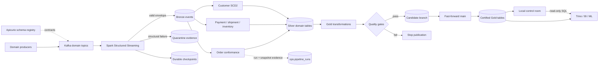
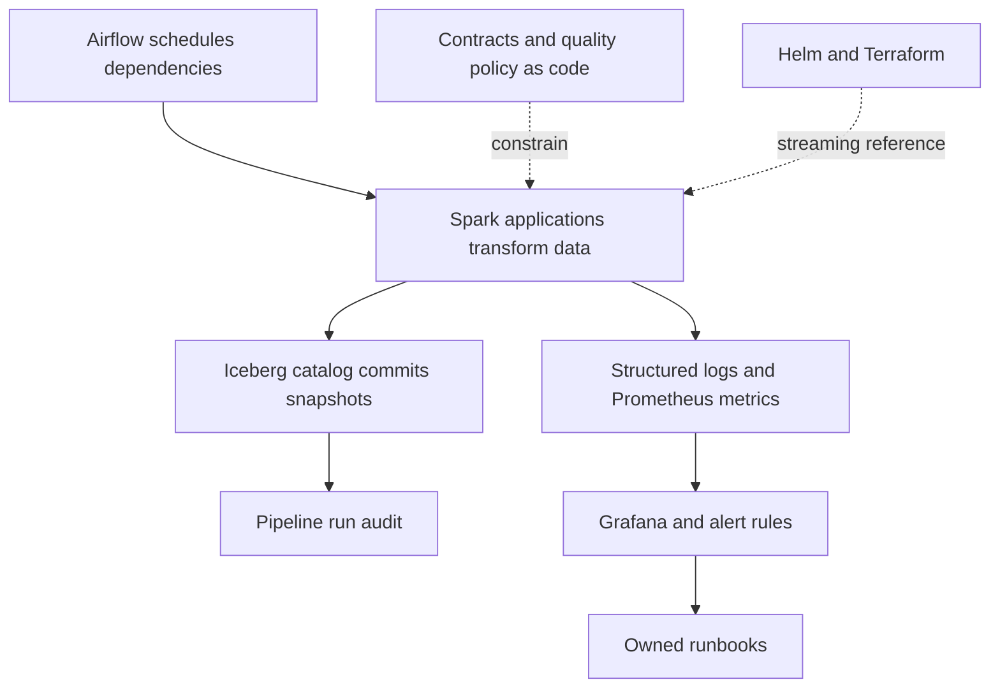
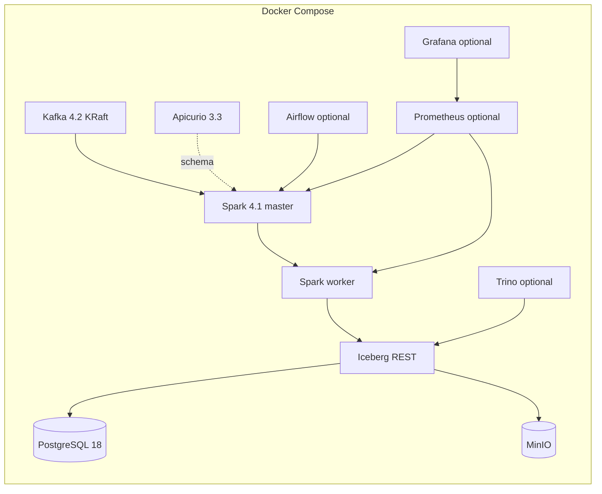
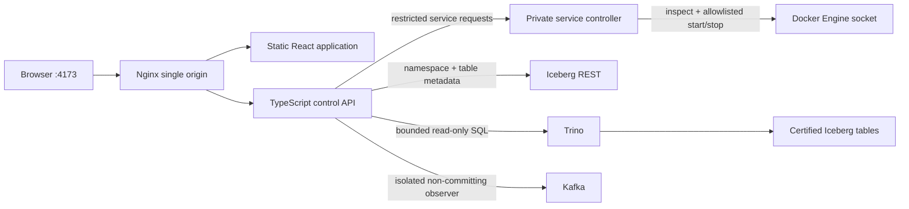

# Marketplace Lakehouse

A production-oriented Apache Spark and Apache Iceberg reference platform for marketplace event
data. It demonstrates how to move from versioned domain events to replayable evidence, deterministic
domain state, and atomically published analytical products without hiding the operational controls
needed between those stages.

This repository contains three complementary deliverables:

1. An executable local lakehouse that runs end to end on synthetic data with Docker Compose.
2. A production deployment reference containing Airflow orchestration, Kubernetes/Spark Operator
   resources, Terraform, monitoring rules, runbooks, and release evidence requirements.
3. A localhost operations dashboard for service health and lifecycle control, Iceberg catalog
   discovery, certified metric visualization, and bounded read-only Trino queries.

The local system is deliberately compact. It preserves the important data contracts, state
boundaries, failure paths, and publication semantics, but it is not presented as a production-sized
cluster or proof of a production SLA.

### Reading guide

- [High-level architecture](#high-level-architecture): system boundaries and data flow.
- [Feature implementation guide](#feature-implementation-guide): algorithms, technologies,
  entry points, and current limitations for each feature.
- [Run the data platform](#run-the-data-platform): setup, simulation, and stress testing.
- [Local credentials](#local-credentials-and-authentication): development login details.
- [Run the architecture website](#run-the-architecture-website): the unified control room.
- [Validation and tests](#validation-and-tests): local checks and CI responsibilities.

## Why this project exists

Marketplace data arrives independently from order, payment, inventory, shipment, and customer
systems. Delivery may be duplicated or late, producer payloads can be malformed, and downstream
analytics must not observe partially refreshed datasets. A credible platform therefore needs more
than a sequence of transformations: it needs evidence, deterministic replay, quality ownership,
atomic publication, and a recoverable state model.

This implementation focuses on those platform concerns:

- schema-governed domain event ingestion;
- durable source-position and malformed-record evidence;
- deterministic, idempotent conformance;
- customer history using SCD Type 2 semantics;
- quality-gated analytical publication through Iceberg branches;
- an operational audit schema and recorded Silver order run evidence;
- bounded backfill and safe table maintenance;
- local observability and a hardened Kubernetes deployment reference.

## Scope

### Implemented and executable

- Five Kafka topics for orders, payments, inventory, shipments, and customer CDC.
- JSON and bundled-schema Avro event-envelope decoding; a versioned compatibility policy.
- Spark Structured Streaming ingestion with a 24-hour watermark and independent accepted and
  quarantine checkpoints.
- Idempotent Iceberg `MERGE` operations using stable business or source-position keys.
- Deterministic order, payment, shipment, inventory, and customer transformations.
- Order history and line-item outputs, plus half-open customer SCD2 validity intervals.
- Daily marketplace KPI and leakage-safe demand-feature transformations.
- Null, uniqueness, accepted-value, non-negative, reconciliation, and SCD2 quality checks.
- Candidate-branch writes and fast-forward publication for Gold rebuilds and bounded backfills;
  an initial Gold publication uses a direct atomic commit.
- Catalog bootstrap, a snapshot-aware audit writer used by order conformance, compaction, manifest
  rewrite, and snapshot expiry.
- Deterministic correlated order, payment, inventory, shipment, and customer CDC simulation with
  smoke, steady, peak, and chaos load profiles.
- Docker Compose profiles for Trino, Prometheus/Grafana, Airflow, and the architecture website.
- A single-origin TypeScript control room with optional-service start/stop controls, live service
  health, a read-only Kafka event tail, catalog browsing, KPI charts, and a guarded read-only SQL
  workbench.
- Unit, property, contract, and transformation tests; linting, strict typing, and dependency audits.

### Production reference, requiring environment integration

- Airflow scheduling and dependency structure.
- Kubernetes `SparkApplication`, service account, resource quota, and network-policy templates.
- Terraform-driven Helm deployment with digest-pinned application images.
- Production configuration rules for TLS Kafka, managed object storage, and workload identity.
- SLO definitions, Prometheus alerts, Grafana provisioning, runbooks, and acceptance evidence.

These files encode the intended controls, but a real deployment still needs cloud IAM/KMS, private
networking and DNS, managed-service endpoints, organizational ownership, capacity testing, chaos and
restore exercises, image signing/scanning, and formal release approval.

### Explicit non-goals

- The repository does not contain or require real customer or production data.
- The compact Docker topology is designed for functional and comparative local load testing, not
  for extrapolating throughput or latency claims to a production cluster.
- The local control room visualizes the supplied demonstration products; it does not define an
  organization-specific BI semantic layer or dashboard catalog.
- Local MinIO, single-node Kafka, and standalone Spark are demonstration substitutes, not the
  recommended production stateful topology.
- Passing local tests is not, by itself, production acceptance. Remaining release evidence is
  listed in [docs/acceptance.md](docs/acceptance.md).

## High-level architecture



The architecture separates five responsibilities:

| Boundary | Owns | Why it exists |
|---|---|---|
| Event transport | Kafka topics and registry contracts | Decouples producers and preserves an ordered replay window. |
| Bronze evidence | Accepted events, quarantine rows, Kafka positions, checkpoints | Makes ingestion failure inspectable and replayable. |
| Silver conformance | Deterministic current state, facts, history, and SCD2 tables | Converts producer events into stable domain meaning. |
| Gold publication | Quality checks, candidate branches, and `main` promotion | Prevents consumers from observing partial or rejected builds. |
| Consumption | Catalog references exposed through Trino or downstream engines | Keeps readers independent from physical files and write privileges. |

### Control plane

The data flow is supported by a control plane rather than embedded orchestration logic:



Airflow submits jobs and defines dependencies; it does not contain transformation logic. Spark owns
computation. Iceberg owns table state and snapshot history. Object storage owns table/checkpoint
bytes, while PostgreSQL backs the local REST catalog metadata.

## Data lifecycle and reliability semantics

### 1. Produce and validate

Every event uses a common envelope containing an event ID and type, version, event and production
times, producer and trace information, a partition key, payload, and optional producer sequence.
Contracts live in [`contracts/`](contracts/); their declared policy is backward-transitive
compatibility. Registry registration and compatibility enforcement are deployment integration work,
not automatic steps in the demo. Breaking changes require a new major schema and parallel topic.

### 2. Ingest to Bronze or quarantine

The ingestion query subscribes to all configured topics, decodes JSON locally or Avro in production,
and preserves Kafka topic, partition, offset, and timestamp. Structurally invalid messages go to an
evidence-preserving quarantine table; valid business-rule violations remain in Bronze with quality
flags. Independent checkpoints keep a poison record from blocking healthy records.

Kafka-to-Bronze is described as **effectively once**, not globally exactly once. That result comes
from the combination of durable Spark checkpoints, bounded event-time deduplication, an idempotent
`event_id` merge, and source-position keys in quarantine.

### 3. Conform to Silver

Silver jobs use stable tie-breakers—event time, producer sequence, Kafka partition, and offset—to
make late or repeated processing deterministic. Their outputs are:

- latest order state, order status history, and order lines;
- latest payment and shipment state;
- inventory balances aggregated by day;
- customer SCD2 history with `[valid_from, valid_to)` intervals and one current row.

`MERGE` keys make a repeated input converge to the same logical state. Quality checks run before
mutation. For Spark 4.1/Iceberg 1.11 compatibility, merge input is materialized once before SQL
planning, preventing multiple reads from seeing different source state.

### 4. Build and certify Gold

Gold transformations build daily marketplace KPIs and demand features. When a published snapshot
already exists, the job resets a candidate branch to current `main`, writes through an explicit
branch-qualified Iceberg identifier, and optionally fast-forwards `main` after checks pass. A failed
job leaves the certified reference unchanged.

This is a write-audit-publish boundary: readers see the old complete snapshot or the next complete
snapshot, never a partially overwritten table.

### 5. Operate and recover

Durable checkpoints are stored separately from table data. The checkpoint path is part of a query's
identity and must not be casually deleted or reused. Recovery depends on four independent assets:
Kafka retention, versioned object storage, catalog database backups, and validated checkpoints.

Maintenance compacts data toward 512 MB files, rewrites manifests, and expires old snapshots while
retaining at least five snapshots and seven days. Orphan deletion is deliberately excluded from the
normal job because it needs a more restricted identity and a separately reviewed safety interval.

## Governed datasets

The catalog bootstraps 12 Iceberg tables:

| Layer | Dataset | Grain / purpose |
|---|---|---|
| Bronze | `bronze.marketplace_events` | One accepted producer event per `event_id`. |
| Quarantine | `quarantine.marketplace_events` | One rejected source position with raw evidence and remediation state. |
| Silver | `silver.orders` | Latest order state per `order_id`. |
| Silver | `silver.order_status_history` | One status fact per source event. |
| Silver | `silver.order_lines` | One line per order-created event; the local payload contains a single SKU. |
| Silver | `silver.payments` | Latest payment state per `payment_id`. |
| Silver | `silver.shipments` | Latest shipment state per `shipment_id`. |
| Silver | `silver.inventory_daily` | Daily SKU/location inventory balance. |
| Silver | `silver.customers_scd2` | Customer version per `customer_id` and `valid_from`. |
| Gold | `gold.daily_marketplace_kpis` | Date, market, and seller-tier KPI grain. |
| Gold | `gold.demand_features` | SKU/location/forecast-date feature grain. |
| Operations | `ops.pipeline_runs` | Audit schema for run identity, inputs, snapshot, counts, sums, quality, and timing; currently written by Silver order conformance. |

Table DDL and governance properties are defined in
[`src/marketplace_data/tables.py`](src/marketplace_data/tables.py); critical ownership, retention,
classification, freshness, and check metadata also live in
[`quality/critical-tables.yaml`](quality/critical-tables.yaml).

## Feature implementation guide

### Technology responsibilities

| Technology | What it does in this repository | Source of configuration |
|---|---|---|
| Python, PySpark, Java, Scala-compatible JVM connectors | Streaming ingestion, distributed SQL/window transformations, quality checks, and Iceberg writes. Python jobs execute through `spark-submit`. | [`pyproject.toml`](pyproject.toml), [`docker/spark/pom.xml`](docker/spark/pom.xml), [`spark.py`](src/marketplace_data/spark.py) |
| Apache Kafka in KRaft mode | Partitioned domain-event transport; keys preserve entity affinity within a topic. | [`docker-compose.yml`](docker-compose.yml) |
| Pydantic, PyYAML, fastavro | Typed configuration and producer envelopes; YAML loading and offline Avro contract parsing. | [`config.py`](src/marketplace_data/config.py), [`contracts.py`](src/marketplace_data/contracts.py) |
| Apache Iceberg REST, PostgreSQL, MinIO | REST catalog backed by PostgreSQL; Iceberg metadata/data and Spark checkpoints in S3-compatible object storage. PostgreSQL does not store the analytical table rows. | [`tables.py`](src/marketplace_data/tables.py), [`docker-compose.yml`](docker-compose.yml) |
| Trino | Read-only interactive SQL over the same Iceberg tables Spark writes. | [`Trino catalog`](infrastructure/trino/catalog/lakehouse.properties), [`access control`](infrastructure/trino/access-control.properties) |
| React, TypeScript, Vite, CSS/SVG | Browser application, architecture explorer, dashboard components, and production static build. No external charting library is required. | [`architecture-site/package.json`](architecture-site/package.json), [`src/`](architecture-site/src/) |
| Node.js native HTTP, Nginx | Authenticated control API, private service controller, static hosting, and same-origin `/api/` proxy. | [`server/`](architecture-site/server/), [`nginx.conf`](architecture-site/nginx.conf) |
| Confluent Python and JavaScript Kafka clients | Synthetic producers and offset capture in Python; topic metadata and bounded event observation in TypeScript. | [`simulator.py`](src/marketplace_data/simulator.py), [`kafka.ts`](architecture-site/server/kafka.ts) |
| prometheus-client, Prometheus, Grafana, structlog | Durable last-run metrics, scraping, alerts, provisioned panels, and structured Python logs. | [`telemetry.py`](src/marketplace_data/telemetry.py), [`observability/`](observability/) |
| Airflow, Spark Operator/Helm, Terraform | Optional local scheduling and environment-specific production deployment references. | [`orchestration/`](orchestration/), [`infrastructure/`](infrastructure/) |

Exact versions are recorded in the manifests, image digests, npm lockfile, and
[`requirements/runtime.lock`](requirements/runtime.lock). The lockfile constrains Python application
image dependencies; Spark JVM dependencies are separately pinned in the Maven build.

### Configuration, contracts, and catalog bootstrap

[`load_settings`](src/marketplace_data/config.py) loads a YAML profile and applies `MLH_` environment
overrides, using `__` to address nested settings. For example,
`MLH_PROCESSING__SHUFFLE_PARTITIONS=32` overrides `processing.shuffle_partitions`. Unknown keys,
including nested typos, are rejected. Secrets use Pydantic `SecretStr` and are excluded from the
configuration hash/loggable representation. Production validation rejects plaintext Kafka,
HTTP object storage, and static S3 keys; it does not provision TLS certificates or SASL credentials.

[`EventEnvelope`](src/marketplace_data/contracts.py) validates synthetic producer IDs, domain
prefixes, UTC timestamps, and decimal-string amounts. This producer-side validation is separate
from Spark's ingestion checks: Bronze does not invoke Pydantic for every Kafka record. The JSON
Schemas in `contracts/` are contract artifacts exercised by tests, not a general runtime payload
validation engine. Apicurio runs locally as a registry service, but the local JSON pipeline neither
registers nor downloads schemas from it. The Avro path strips the five-byte Confluent header and
decodes with the bundled `event-envelope-v1.avsc`; it does not resolve or validate the header's schema
ID. Multi-version registry lookup and automatic compatibility enforcement are not implemented.

[`bootstrap_tables`](src/marketplace_data/tables.py), called by
[`apps/bootstrap_catalog/main.py`](apps/bootstrap_catalog/main.py), creates the five namespaces and
12 tables with explicit types, partitions, and Iceberg properties. Repeating bootstrap is safe;
`CREATE TABLE IF NOT EXISTS` is not a schema migration mechanism. Table changes need a reviewed
migration. [`build_spark_session`](src/marketplace_data/spark.py) configures UTC, adaptive execution,
Iceberg extensions, and both S3 clients: Iceberg S3FileIO for tables and Hadoop S3A for checkpoints.

### Synthetic data, quick demo, and concurrent stress tests

There are two intentional producer entry points, not duplicate implementations:

- [`generator.py`](src/marketplace_data/generator.py) supports the small order-only demonstration.
  [`scripts/demo.sh`](scripts/demo.sh) bootstraps the catalog, emits orders, ingests the available
  Kafka data, conforms orders, publishes KPIs, and displays the result.
- [`simulator.py`](src/marketplace_data/simulator.py) creates correlated customer, order, payment,
  inventory, and shipment lifecycles. A seed makes generated identifiers and choices reproducible;
  profile parameters control volume, pacing, duplicates, malformed payloads, and late events.
  Producer callbacks record delivery outcomes and acknowledgement latency. Target events/s is a
  producer pacing setting, not a guaranteed end-to-end processing rate.

`make simulate` only publishes messages. It does not itself run Bronze/Silver/Gold: events appear
in the Kafka observer immediately, while tables change only when ingestion and conformance run.
For both production and processing, use `make stress`. Its
[`runner`](scripts/stress-test.sh) captures starting partition offsets, starts a dedicated ingestion
process/checkpoint, waits for readiness, and then starts the producer. After a completion signal,
ingestion drains both queries before the runner launches all three Silver jobs and the KPI job.

[`stress_report.py`](src/marketplace_data/stress_report.py) reconciles only the current simulation's
IDs and marker. It compares unique valid events, physical malformed messages, per-domain Silver
entities, and Gold aggregates against producer/Bronze/Silver evidence. Explicitly injected lateness
is the only allowed accepted-event shortfall. Failure of these checks makes the command fail.
The reports distinguish producer acknowledgement from Kafka-to-Bronze latency, and account for
overlapping producer/ingestion time. Demand-feature builds are separate and are not part of this run.

### Bronze ingestion, deduplication, and quarantine

[`jobs/bronze_ingest.py`](src/marketplace_data/jobs/bronze_ingest.py) subscribes to all configured
topics through Spark's Kafka connector. [`transforms/bronze.py`](src/marketplace_data/transforms/bronze.py)
decodes the envelope, retains topic/partition/offset/timestamp, and adds run identity and ingestion
time. Missing required routing fields or unparseable envelopes go to quarantine with raw evidence,
error details, and initial `PENDING` remediation state. Quarantine is inspectable via SQL; there is
no implemented remediation editor or automatic correction/replay workflow.

Parseable records receive business-quality flags such as invalid amounts, timestamps, or currency
format. These remain in Bronze and are excluded by the Silver transforms. Numeric checks use
`try_cast`, preventing malformed numeric strings from terminating the whole Spark batch. Accepted
records use a configurable event-time watermark (24 hours locally),
`dropDuplicatesWithinWatermark(event_id)`, and an Iceberg merge keyed by `event_id`. Events beyond
the watermark can be dropped by Spark; they are not automatically routed to quarantine.

The accepted and quarantine streams have independent checkpoints. Quarantine uses an insert-only
merge keyed by source topic/partition/offset, preserving first-seen evidence on replay. These are
two separate table commits, not one cross-table transaction. The job can run continuously,
`--available-now` for bounded catch-up, or with the stress runner's completion-file handshake.
The shared parser exposes `--dry-run`, but Bronze does not implement a non-writing dry run: do not
use that flag as an ingestion safety control.

### Iceberg writes, replay, and publication boundaries

[`IcebergRepository`](src/marketplace_data/iceberg.py) validates SQL identifiers and centralizes
merges, full replacements, branch creation, promotion, and audit writes. Merge input is cached and
rebuilt from its RDD to work around the pinned Spark/Iceberg planning incompatibility and stabilize
the source across a merge's reads. SQL executes in the source DataFrame's Spark session, which is
important inside `foreachBatch`. Temporary views and caches are cleaned up after the write.

`current_snapshot_id` reads the `main` reference from Iceberg's `refs` metadata, not the newest
snapshot across all branches. Candidate creation starts from current `main`; branch-qualified writes
remain isolated until explicit fast-forward promotion. The first Gold write has no existing snapshot
to branch from, so it requires `--publish` and writes directly to `main` in one atomic commit.
Later builds can be staged without promotion. Publication is atomic per table, not across an entire
Silver/Gold release. Serialize writers per pipeline; independent jobs are not coordinated by a
global transaction manager.

### Silver: orders, payments, shipments, and inventory

[`orders.py`](src/marketplace_data/transforms/orders.py) filters eligible order event types and
casts the payload to typed columns. A window ranks each order by event time, producer sequence,
partition, and offset to pick current state. Separate transforms retain one status fact per event
and extract one line from each order-created payload. Multi-line baskets require a different
payload/line key; the supplied model is deliberately single-SKU per order-created event.

[`domains.py`](src/marketplace_data/transforms/domains.py) maps payment and shipment event types to
statuses and uses equivalent deterministic ranking by domain ID. Inventory sums signed quantity
changes by SKU/location/date, then computes a cumulative balance and stockout flag. These jobs
read the current Bronze dataset and merge by their documented table keys. They do not run payment
capture, shipping, or inventory reservation APIs: they reconstruct analytical state from events.

[`jobs/silver_orders.py`](src/marketplace_data/jobs/silver_orders.py) also accepts snapshot bounds
and records input evidence, output snapshot, row counts, code/config identity, and quality status in
`ops.pipeline_runs`. Only this job currently writes that audit table, and its business-sum map is
empty; stress reports supply additional reconciliation. Default full-source runs produce the intended
current-state result. Incremental snapshot reads and bounded backfills need particular care: a merge
updates matching keys unconditionally, so an older input subset can replace newer target state.

### Silver: customer SCD Type 2 history

[`transforms/scd2.py`](src/marketplace_data/transforms/scd2.py) extracts customer CDC attributes,
hashes the tracked attributes, deterministically resolves competing changes at the same instant,
and suppresses consecutive changes with the same hash. Spark `lead` computes the next change time
as `valid_to`; the last version is current. Intervals are half-open, so a change at time T closes
the preceding interval at T without overlapping the new one.

[`jobs/silver_customers.py`](src/marketplace_data/jobs/silver_customers.py) rebuilds from complete
Bronze history and atomically replaces the target, removing obsolete boundaries caused by late
changes. Before writing and again after reading the persisted result, it checks version uniqueness,
one current row per customer, and non-overlapping intervals. Full-history retention and one writer
are required. This is not an incremental CDC connector or a source-database replication service.

### Gold KPIs and demand features

[`daily_marketplace_kpis`](src/marketplace_data/transforms/gold.py) aggregates Silver orders by
creation date, market, and seller tier. It computes order count, gross amount sum (GMV), cancellations,
cancellation rate, and an order-based `net_revenue` excluding cancelled/refunded orders. The executable
job supplies no seller dimension, so tier is `UNCLASSIFIED`. Payment, shipment, and customer tables
are available for SQL analysis but are not joined into this KPI calculation. Amounts are not FX
converted and currency is not a grouping key: producers must use a consistent reporting currency
per group, or the mart must be extended before financial use. `net_revenue` is not settled cash,
accounting revenue, or profit.

[`demand_features`](src/marketplace_data/transforms/gold.py) sums line quantities by SKU/location/date,
then builds lag-1/lag-7 and trailing 7/28-observation averages, excluding the current row from each
rolling window. It joins same-date inventory and stockout data. The windows count observed rows,
not calendar days; missing dates are not filled. Current-day demand and stock remain in the output,
so a forecasting consumer must enforce its own as-of cutoff and feature selection. No model training,
prediction API, or point-in-time feature store is included.

Both Gold jobs quality-check candidates and use dynamic partition overwrite with optional branch
promotion. Dynamic overwrite replaces represented partitions; it does not remove an old partition
that disappears entirely from input. The demand job is runnable via
[`apps/gold_marts/demand_features.py`](apps/gold_marts/demand_features.py), but neither the quick demo
nor the default DAG runs it.

### Quality gates, backfills, and maintenance

[`quality.py`](src/marketplace_data/quality.py) implements reusable null, uniqueness, accepted-value,
non-negative, reconciliation, and SCD2 checks. Jobs explicitly select their gates and call `enforce`;
failed ERROR checks raise `QualityGateError` before the intended write. `quality/critical-tables.yaml`
records governance metadata but is not dynamically interpreted to run checks. A passing gate only
proves the checks actually invoked, not complete semantic correctness or non-empty input.

[`backfill.py`](src/marketplace_data/jobs/backfill.py) filters Bronze by an inclusive date range
(end-minus-start at most 31 days), conforms orders, checks keys, and merges into an explicit candidate
branch. `--publish` promotes it; `--dry-run` checks without writing. It updates only `silver.orders`,
not dependent history, lines, or Gold. Review affected keys and later events before promotion, then
rebuild dependent products; it is not a generic automatically coordinated recovery system.

[`maintenance.py`](src/marketplace_data/jobs/maintenance.py) calls Iceberg's data-file rewrite,
manifest rewrite, and snapshot-expiration procedures. Target file size defaults to 512 MB; retention
is bounded to 168–8,760 hours and keeps at least five snapshots. Its dry run reports file counts.
It deliberately does not delete orphan files. The separate
[`benchmark harness`](benchmarks/run.py) measures a synthetic skewed join and records execution plan
and environment evidence; it is distinct from the end-to-end Kafka stress test.

### Website: architecture exploration and operational dashboard

[`App.tsx`](architecture-site/src/App.tsx) combines the public architecture explanation with a
login-gated control room. [`ArchitectureMap`](architecture-site/src/components/ArchitectureMap.tsx)
and [`DeploymentPanel`](architecture-site/src/components/DeploymentPanel.tsx) render typed static
descriptions and change the selected stage/profile with React state. They do not infer architecture
from the running cluster. The command-copy button uses the Clipboard API with a legacy DOM fallback,
announces success/failure, and clears its feedback timer on unmount.

[`OperationsDashboard`](architecture-site/src/components/OperationsDashboard.tsx) polls service
state, requests catalog metadata, displays SQL-derived counts and market charts, and hosts the SQL
editor/result table. The charts are React-rendered elements styled in CSS. Catalog discovery calls
Iceberg REST; overview and editor queries use Trino. Thus catalog browsing can work while Trino is
stopped, but metrics and SQL require Trino and populated tables. The frontend shows request errors
instead of presenting generated sample data as live results.

The [`native Node HTTP API`](architecture-site/server/index.ts) exposes these responsibilities:

| Endpoint | Implementation / access |
|---|---|
| `POST /api/login`, `GET /api/session`, `POST /api/logout` | Credential check and signed session lifecycle; login is public, session/logout require authentication. |
| `GET /api/services` | Parallel inspections through the private service controller; viewer or operator. |
| `POST /api/services/:id/start` or `/stop` | Operator-only allowlisted lifecycle actions and dependency checks. |
| `GET /api/catalog` | Namespace/table discovery via Iceberg REST; authenticated. |
| `GET /api/overview` | Counts and Gold market aggregates via Trino; authenticated. |
| `POST /api/query` | Bounded read-only SQL execution; viewer or operator. |
| `GET /api/kafka/topics`, `GET /api/kafka/topics/:topic/events` | Kafka topic metadata and recent events; authenticated. |

[`policy.ts`](architecture-site/server/policy.ts) restricts SQL to one read-oriented statement of at
most 12,000 characters. This is a conservative text filter, not a SQL parser, so forbidden words in
strings/comments may also be rejected. The independent Trino read-only policy is the write-security
boundary. [`trino.ts`](architecture-site/server/trino.ts) follows result pages with a 30-second
deadline, 200-page limit, and 500-row response cap, marking truncated results and attempting
cancellation on unfinished queries. These response limits do not guarantee low server-side query
cost; production also needs Trino resource groups and workload admission controls.

### Website: login, service control, and live Kafka inspection

[`auth.ts`](architecture-site/server/auth.ts) has two environment-configured local identities:
operator and viewer. Passwords must be distinct and at least 16 characters. Authentication uses
timing-safe digest comparison; signed HMAC cookies carry expiring sessions. HttpOnly/SameSite=Strict,
a dashboard request header for POSTs, request size limits, and no cross-origin API access constrain
browser requests. Login attempts are limited in memory; behind the supplied Nginx proxy the API sees
the proxy address, so the limit is effectively shared. Logout revokes the session; API restart
invalidates all sessions. This is a local authentication model, not a multi-replica SSO system.

[`controller-client.ts`](architecture-site/server/controller-client.ts) calls an isolated
[`service controller`](architecture-site/server/controller.ts), which uses
[`docker.ts`](architecture-site/server/docker.ts) to inspect exact project containers and start/stop
only Trino, Prometheus, and Grafana. Core containers are read-only in the UI. The web API has no Docker
socket. The controller has no published port and shares an internal network with the API; access to
the Docker socket still gives it host-equivalent privilege. It cannot be treated as an untrusted
multi-tenant management service. Lifecycle requests/outcomes are logged as structured audit events.

[`KafkaMonitor`](architecture-site/src/components/KafkaMonitor.tsx) polls topic summaries every five
seconds and the selected tail every two seconds; this is polling, not WebSocket streaming.
[`kafka.ts`](architecture-site/server/kafka.ts) filters to `marketplace.*`, estimates retained counts
from high-minus-low offsets, seeds up to 12 recent records per partition, and buffers at most 100
events per topic in memory. Responses default to 30 records (maximum 50); payload display is bounded
to 16 KiB. JSON is formatted when possible; malformed/non-JSON data stays text. This observer does
not decode Avro into domain objects. Offset spans are not exact logical event counts after compaction
or offset gaps, and buffered tails are neither durable nor exhaustive histories. Auto-commit is
disabled and the observer uses a separate consumer group, leaving ingestion offsets untouched.

### Observability and orchestration

[`jobs/common.py`](src/marketplace_data/jobs/common.py) supplies run identity and the `observed`
wrapper used by Bronze, Silver orders/customers/domains, and Gold KPIs. It records terminal success,
failure, duration, and quality-failure times through [`telemetry.py`](src/marketplace_data/telemetry.py).
When `MLH_METRICS_DIRECTORY` is configured, records are merged into per-pipeline JSON files using
atomic file replacement. The local exporter reads that shared volume and serves gauges on port 8000,
so evidence outlives the Spark process. It assumes one writer per pipeline and stores last-run state,
not a full event log or failure counter. Auxiliary jobs are not fully instrumented for terminal
outcomes. Bronze additionally records the newest batch source timestamp and heartbeat; the exported
source-to-Bronze value is not a latency percentile. Stress reports compute run-specific percentiles.

Prometheus scrapes this exporter plus Spark master/worker Prometheus servlets. Grafana panels show
Spark availability, last-run duration, Bronze source-event age, and whether a quality failure was
recorded in the last hour. These use the durable gauges, not transient per-process row counters.
[`alerts.yml`](observability/prometheus/alerts.yml) evaluates availability, failed jobs, quality
failure, and stale Bronze input; stopping the simulator can legitimately produce a freshness alert.
The configured SLOs are objectives, not claims that the supplied panels prove a 30-day SLA.

The [`Airflow DAG`](orchestration/dags/marketplace_lakehouse.py) schedules bounded ingestion every
five minutes, followed by orders, customers, and domain conformance. Gold waits for orders and
domains. It disables catch-up, permits one active DAG run, and retries failed tasks twice. The local
DAG uses the local profile and standalone Spark connection; it does not deploy the cloud topology.
Helm currently describes the streaming Spark workload and supporting policies, not a complete managed
Kafka/object-store/Trino/Airflow installation. Production metrics persistence, identity, secrets,
registry integration, and writable Spark runtime/event-log storage still need environment wiring.

## Deployment views

### Local executable profile



Named volumes preserve catalog metadata, objects, and observability state across normal shutdowns.
Local credentials are development-only values sourced from the ignored `.env` file.

MinIO and its `mc` initialization client are built from official, pinned source commits in
[`docker/minio/Dockerfile`](docker/minio/Dockerfile). This avoids the unavailable upstream Docker Hub
and Quay images. The server uses the October 2025 security release, while the client retains its
configured August 2025 release. Compose builds these images automatically; the first build needs
network access to GitHub, the Go module proxy, and the pinned base-image registries. Object data,
bucket initialization, local credentials, and service URLs use the existing configuration.

### Production reference profile

The Helm chart deploys digest-pinned Spark workloads to Kubernetes with non-root security contexts,
dropped Linux capabilities, read-only root filesystems, resource quotas, service accounts, and
network policy. Terraform installs the chart. Airflow orchestrates independent applications against
managed Kafka, registry, catalog, and object-storage endpoints. Static S3 credentials and plaintext
Kafka are rejected by production configuration validation; workload identity is expected.

## SLOs and observability

| Indicator | Objective |
|---|---:|
| Bronze freshness | p95 ≤ 3 minutes; p99 ≤ 8 minutes over 30 days |
| Silver freshness | p95 ≤ 15 minutes |
| Certified daily close | 06:00 UTC |
| Critical pipeline success | ≥ 99.5% monthly |
| Streaming RPO | ≤ 5 minutes |
| Single-job RTO | ≤ 30 minutes |
| Certified source-position reconciliation | 100% |

Spark exposes Prometheus-format telemetry; the repository provisions Prometheus scraping, a Grafana
dashboard, and alerts for unavailable Spark control/worker processes and quality failures. Every
page links to an owner and a runbook. The supplied local dashboard is illustrative; production
alerting should use multi-window SLO burn rates and an organizational paging backend.

## Compatibility set

The runtime dependency set is pinned to Spark 4.1.3 / Scala 2.13 with the Iceberg 1.11.0 Spark 4.1
runtime. The architecture site uses React 19.2.8, Vite 8.2.2, and TypeScript 6.0.3. These are the
repository's tested compatibility choices, not a claim to track the newest releases automatically.

See [docs/version-policy.md](docs/version-policy.md) for the complete matrix and controlled upgrade
procedure.

## Run the data platform

Prerequisites:

- Docker Engine 29+ with Compose 5+ and at least 8 GB available memory;
- Python 3.10–3.14 for host-side validation;
- GNU Make;
- WSL/Linux. Airflow production deployments are Linux-only.

Clone the repository into any directory, then run the setup from the cloned project root:

```bash
git clone https://github.com/acilione/marketplace_lakehouse.git
cd marketplace_lakehouse
[ -f .env ] || cp .env.example .env
make bootstrap
make demo
```

If the repository is already cloned, skip the first two commands and run the remaining commands
from its root directory. No command or application configuration depends on the clone's absolute
filesystem path.

`make demo` builds and starts the core services, creates topics and tables, emits 2,000 deterministic
synthetic order events with injected edge cases, executes Bronze → Silver orders → Gold KPIs, and
prints the certified results. Each invocation uses an isolated replay checkpoint, so a recreated
local Kafka broker cannot conflict with offsets retained by MinIO from an earlier demonstration.
The first image build can take several minutes.

### Simulate all five marketplace domains

`make simulate` publishes correlated commerce lifecycles across every topic: customer changes,
inventory adjustments and reservations, order transitions, payment outcomes, and shipment
progress. The default smoke profile creates 100 orders and writes a machine-readable producer
report under the ignored `benchmark-results/` directory.

```bash
make dashboard-up
make simulate
```

Keep <http://localhost:4173> open while the simulator runs. Topic counts refresh every five seconds
and the selected event feed refreshes every two seconds. Each execution uses a timestamp-based seed
by default, so repeated simulations create new business and event identifiers.

| Profile | Orders | Target events/s | Purpose |
|---|---:|---:|---|
| `smoke` | 100 | 250 | Fast functional verification on a laptop. |
| `steady` | 5,000 | 1,000 | Sustained representative local traffic. |
| `peak` | 15,000 | 2,000 | Required local burst scenario. |
| `chaos` | 5,000 | 1,500 | Elevated duplicate, malformed, late, and failed business outcomes. |

Override the business volume, target rate, or fault rates without changing source code:

```bash
make simulate \
  SIMULATION_PROFILE=peak \
  SIMULATION_ARGS="--orders 20000 --events-per-second 2500 --late-rate 0.05"
```

For a full, quality-gated stress run, use `make stress`. It starts the control room and optional
query/observability services, captures each Kafka partition's starting offset, starts ingestion,
and publishes all five domains while ingestion runs. It drains the accepted and quarantine streams
after producer completion, runs every Silver job, publishes Gold, and reconciles the results.

```bash
# Quick end-to-end validation
make stress STRESS_PROFILE=smoke

# Sustained scenario; expect this to take several minutes locally
make stress STRESS_PROFILE=steady

# Override profile volume/rate when sizing a specific machine
make stress \
  STRESS_PROFILE=peak \
  STRESS_ARGS="--orders 20000 --events-per-second 2500"
```

Every run writes `producer.json`, per-topic Bronze evidence, ingestion latency/quarantine evidence,
dataset row counts, and a final `report.json` under `benchmark-results/stress_<profile>_<seed>_*`.
The final report includes achieved producer throughput, delivery failures, p50/p95 acknowledgement
latency, injected fault counts, p50/p95 Kafka-to-Bronze latency, quarantine rate, phase durations,
and explicit pass/fail checks. Each run has unique entity/event identifiers and a simulation marker;
historical or unrelated messages cannot satisfy its acceptance checks. Accepted unique records must
match the producer's expected count, allowing only explicitly injected late records to be dropped
by the watermark. Every malformed message must reach quarantine. Silver entity counts are compared
with that run's Bronze keys; Gold counts, GMV and net revenue are compared with Silver aggregates.
Producer duration overlaps Bronze duration and is reported separately, not added twice.
Inspect `bronze.log` in the result directory for live processing progress. Local results are evidence for comparison on the recorded machine;
they are not production capacity claims.

### Complete end-to-end verification checklist

Below there is a complete command list in order to test the end-to-end pipeline.

- [ ] **Confirm the required tools are available.**

  ```bash
  docker version
  docker compose version
  python3 --version
  make --version
  ```

- [ ] **Create local configuration and install the locked development environment.** Review `.env`
  before continuing if its values differ from the documented local defaults.

  ```bash
  [ -f .env ] || cp .env.example .env
  make bootstrap
  ```

- [ ] **Run all deterministic repository checks.** `make check` covers formatting, linting, strict
  Python typing, Python tests with coverage, TypeScript lint/tests/builds, and Compose rendering.
  The security audit additionally requires network access to the Python and npm advisory services.

  ```bash
  make check
  make security
  ```

- [ ] **Start the core platform and unified control room.** All services reported by `docker
  compose ps` should be running; services with health checks should be `healthy`.

  ```bash
  make dashboard-up
  docker compose ps
  curl -fsS http://localhost:4173/healthz
  ```

  `/healthz` checks static web-server availability, not platform readiness. Sign in to the control
  room to inspect service states; `/api/services` correctly returns HTTP 401 without a session.

- [ ] **Start and verify the optional query and observability services.** They can instead be
  started from their cards at <http://localhost:4173>.

  ```bash
  docker compose --profile query --profile observability up -d --wait trino prometheus grafana
  curl -fsS http://localhost:8088/v1/info
  curl -fsS http://localhost:9090/-/ready
  curl -fsS http://localhost:3000/api/health
  ```

- [ ] **Observe Kafka while exercising every domain.** Open the Kafka topic observer at
  <http://localhost:4173> first, and then run the smoke simulator in a second terminal. Select each
  topic and confirm that its counter and event cards update.

  ```bash
  make simulate SIMULATION_PROFILE=smoke
  ```

- [ ] **Verify the broker independently.** The first command must list the five `marketplace.*`
  domain topics. The second prints three stored order records and exits; each row should include a
  timestamp, partition, offset, key, and JSON payload.

  ```bash
  docker compose exec kafka /opt/kafka/bin/kafka-topics.sh \
    --bootstrap-server localhost:9092 --list

  docker compose exec kafka /opt/kafka/bin/kafka-console-consumer.sh \
    --bootstrap-server localhost:9092 \
    --topic marketplace.orders.v1 \
    --from-beginning \
    --max-messages 3 \
    --formatter-property print.timestamp=true \
    --formatter-property print.partition=true \
    --formatter-property print.offset=true \
    --formatter-property print.key=true
  ```

- [ ] **Query certified data through Trino.** The Bronze count should be non-zero, and the Gold
  query should return daily rows grouped by market after `make stress STRESS_PROFILE=smoke`
  completes. If it has not run yet, execute it before these queries:

  ```bash
  make stress STRESS_PROFILE=smoke
  ```

  ```bash
  docker compose exec trino trino --catalog lakehouse \
    --execute "SELECT count(*) AS bronze_events FROM bronze.marketplace_events"

  docker compose exec trino trino --catalog lakehouse \
    --execute "SELECT metric_date, market, sum(order_count) AS orders, sum(gmv) AS gmv FROM gold.daily_marketplace_kpis GROUP BY metric_date, market ORDER BY metric_date, market"
  ```

- [ ] **Inspect the graphical evidence.** At <http://localhost:4173>, confirm healthy service cards,
  Kafka events, non-zero pipeline metrics, catalog namespaces, and results from a read-only query.
  Also check the Spark master at <http://localhost:8081>, MinIO at <http://localhost:19001>,
  Prometheus at <http://localhost:9090>, and Grafana at <http://localhost:3000>.

- [ ] **Optionally verify orchestration.** The Airflow UI should load at
  <http://localhost:8085> and show the repository DAG after initialization.

  ```bash
  docker compose --profile orchestration up -d --build --wait
  ```

- [ ] **Stop the environment without deleting persistent volumes.**

  ```bash
  make dashboard-down
  make down
  ```

Core platform lifecycle:

```bash
make up
make down
```

Optional operational profiles:

```bash
docker compose --profile query --profile observability up -d --wait
docker compose --profile orchestration up -d --build --wait
```

Local endpoints include Spark master `:8081`, Spark worker `:8082`, MinIO console `:19001`, schema
registry `:8080`, optional Trino `:8088`, Prometheus `:9090`, Grafana `:3000`, and Airflow `:8085`.

### Local credentials and authentication

The following values are development defaults from [`.env.example`](.env.example). Values in the
ignored `.env` file override them. These credentials are intentionally obvious and must never be
used on a shared host or copied into production. Every published local service port is bound to
`127.0.0.1`; Docker-network connections continue to use the internal service names.

| Service | URL / connection | Username | Password | Authentication notes |
|---|---|---|---|---|
| Control room operator | <http://localhost:4173> | `operator` | `change-me-local-operator-password` (`DEV_DASHBOARD_OPERATOR_PASSWORD`) | Data access and optional service control. |
| Control room viewer | <http://localhost:4173> | `viewer` | `change-me-local-viewer-password` (`DEV_DASHBOARD_VIEWER_PASSWORD`) | Data access only. |
| MinIO console | <http://localhost:19001> | `marketplace_local` (`DEV_MINIO_ROOT_USER`) | `change-me-local-minio-password` (`DEV_MINIO_ROOT_PASSWORD`) | Development root account. |
| Grafana | <http://localhost:3000> | `admin` (`DEV_GRAFANA_ADMIN`) | `change-me-local-grafana-password` (`DEV_GRAFANA_PASSWORD`) | Login is required; anonymous access is disabled. |
| Airflow | <http://localhost:8085> | `admin` (`DEV_AIRFLOW_ADMIN`) | `change-me-local-airflow-password` (`DEV_AIRFLOW_PASSWORD`) | Available only with the `orchestration` profile. |
| PostgreSQL | Internal `postgres:5432` | `marketplace_local` (`DEV_POSTGRES_USER`) | `change-me-local-postgres-password` (`DEV_POSTGRES_PASSWORD`) | Not published to the host. Databases: `iceberg` and `airflow`. |
| Prometheus | <http://localhost:9090> | — | — | No login in this local profile; its port is restricted to the loopback interface. |
| Trino | <http://localhost:8088> | — | — | Loopback inspection only; server-side read-only access control blocks writes. |
| Spark UIs | <http://localhost:8081>, <http://localhost:8082> | — | — | No login in the local standalone profile. |
| Schema registry | <http://localhost:8080> | — | — | No login locally; destructive REST operations are disabled. |
| Iceberg REST | <http://localhost:8181> | — | — | No HTTP login locally; object-store credentials are injected server-side. |
| Kafka | `localhost:29092` | — | — | Plaintext listener with no SASL; never expose it outside the workstation. |

Grafana uses these variables when its data volume is initialized. If the volume already exists,
apply the currently configured password after starting Grafana:

```bash
docker compose --profile observability up -d grafana
docker compose exec grafana sh -ec \
  'grafana cli admin reset-admin-password "$GF_SECURITY_ADMIN_PASSWORD"'
```

## Run the architecture website

The TypeScript website in [`architecture-site/`](architecture-site/) combines the architecture tour
with a local operations dashboard. Static architecture content works without the platform; live
service control, table discovery, metrics, and queries require the dashboard profile.

Start the dashboard and its core platform with one command:

```bash
make dashboard-up
```

Then open <http://localhost:4173>. This creates—but does not start—the optional Trino, Prometheus,
and Grafana containers so their lifecycle can be controlled from the page. The first Trino image
download is large. Run `make demo` once to populate the metric cards and query results.



The service cards refresh every ten seconds. Core services are visible but intentionally not
controllable; stopping PostgreSQL, MinIO, Kafka, or Spark independently would violate dependency and
state guarantees. Trino, Prometheus, and Grafana can be started and stopped from their cards. The
catalog browser selects a table into the query editor, while metric and result panels keep the
common data-inspection workflow on the same page.

The Kafka topic observer shows every `marketplace.*` topic, retained-message and partition counts,
and recent records with event time, key, partition, offset, size, and formatted payload. Topic
counts refresh every five seconds and the selected event tail refreshes every two seconds. It uses
a dedicated `marketplace-dashboard-observer` consumer with auto-commit disabled, so inspecting
events does not advance any ingestion or application consumer offset. Its tail is bounded to 100
in-memory records per topic and 30 records per response.

To watch all five domain topics receive correlated events, keep <http://localhost:4173> open on the
Kafka observer and run this in a second terminal:

```bash
make simulate
```

The direct Kafka CLI remains useful when debugging without the website:

```bash
# List topics
docker compose exec kafka /opt/kafka/bin/kafka-topics.sh \
  --bootstrap-server localhost:9092 --list

# Follow new order events until Ctrl-C
docker compose exec kafka /opt/kafka/bin/kafka-console-consumer.sh \
  --bootstrap-server localhost:9092 \
  --topic marketplace.orders.v1 \
  --formatter-property print.timestamp=true \
  --formatter-property print.partition=true \
  --formatter-property print.offset=true \
  --formatter-property print.key=true
```

Stop the dashboard and optional services without deleting data:

```bash
make dashboard-down
```

The architecture remains readable without login; all data/control API endpoints require a signed,
HttpOnly, SameSite=Strict session. Sessions expire after eight hours and are invalidated on API
restart. Failed login attempts are rate-limited. Operators can control allowlisted optional services;
viewers can inspect and query. Service requests and outcomes emit structured audit logs without passwords.
The API has no Docker socket. A separate non-root controller owns it on an internal network joined
only by the API and controller, with no host port and no arbitrary Docker API forwarding. The controller
still has host-equivalent privilege and must remain isolated. Nginx binds to loopback by default.
For any shared deployment, replace both development passwords and terminate HTTPS at a trusted proxy
with `AUTH_SECURE_COOKIE=true`; integrate your identity provider and centralized audit retention.
SQL has a 30-second deadline, a 500-row result cap, explicit pagination-limit failures and cancellation.
Trino independently enforces read-only access, including for clients bypassing the dashboard.

Spark master/worker Prometheus servlets are explicitly configured in the image. Short-lived jobs
persist last-success, last-failure, quality-failure and duration metrics in the `pipeline-metrics`
volume; its exporter remains available after jobs exit. Bronze also records progress heartbeat and
source event freshness/lag. Prometheus scrapes the exporter and alerts on failed runs, stale Bronze
events and missing scrape targets. A stopped producer can legitimately trigger the freshness alert.
The five core pipelines assume one writer per pipeline. Customer SCD2 performs a full atomic history
replacement, including obsolete boundaries, and requires complete Bronze history; retaining only
part of that history requires an affected-customer reconciliation implementation before deployment.

Additional regression commands (after `make dashboard-up` and starting Prometheus):

```bash
make check
make security
make integration-correctness
make monitoring-test
make stress STRESS_PROFILE=smoke
```

`integration-correctness` creates a UUID-named temporary Iceberg table and removes only that test
table after verifying branch isolation, late-customer reconciliation and replay. `monitoring-test`
checks alert firing with synthetic time series; it does not inject failures into live datasets.

To run only the static architecture website, without Docker control:

```bash
make architecture-up
```

Then open <http://localhost:4173>. Stop it with:

```bash
docker compose --profile architecture down
```

For frontend development with Node 22.12+:

```bash
cd architecture-site
npm ci
npm run dev
```

Publishing is optional and disabled for automatic pushes. The
[`architecture-pages.yml`](.github/workflows/architecture-pages.yml) workflow is manual-only:
enable GitHub Pages with **GitHub Actions** as its source, then explicitly dispatch the workflow
if publication is wanted later. It publishes only static architecture content; it cannot host the
Node control API, Docker controller, or live lakehouse. Normal CI still tests and builds the website
without requiring Pages to be enabled. A `configure-pages` HTTP 404 indicates missing Pages setup,
not a failed frontend build; no Pages setup is needed for local use.

## Validation and tests

Run all Python and TypeScript tests:

```bash
make test
```

Run the complete lint, type, test, frontend build, and Compose validation gate:

```bash
make check
```

Run source and Python dependency security checks:

```bash
REQUESTS_CA_BUNDLE=/etc/ssl/certs/ca-certificates.crt make security
```

Frontend-only checks run in the pinned Node container, so a host Node installation is not required:

```bash
make architecture-check
```

### What the checks cover

- Python `pytest` tests cover contracts, configuration, pure transformations, quality checks,
  simulator/report accounting, Iceberg repository behavior, and telemetry. Hypothesis supplies
  property-based cases. Spark transformation tests run a local Spark session; repository unit tests
  are not a substitute for exercising a real catalog. Coverage has an 80% threshold with explicit
  infrastructure/job exclusions in `pyproject.toml`.
- Ruff enforces formatting/linting, mypy checks Python types, ESLint checks TypeScript, and `tsc`
  checks/builds browser and server code. Vitest covers architecture data, authentication, service/SQL
  policy, Kafka decoding/counts, and Trino result handling; this is not a browser end-to-end suite.
- Bandit, pip-audit, and npm audit check source patterns and known dependency advisories. Passing
  them is not an independent security assessment.
- `make integration-correctness` exercises real Iceberg branch isolation, late SCD2 replacement,
  and replay using its own temporary table. `make monitoring-test` runs Prometheus alert fixtures.
  `make stress STRESS_PROFILE=smoke` reconciles the five-domain path against a live local stack.

[`ci.yml`](.github/workflows/ci.yml) runs on pull requests and pushes to `main`. It installs Python
tools in `.venv`, matching Make's default, runs checks and dependency audits, builds container images,
validates workflow syntax/shell scripts with actionlint, checks effective image users and the
source-built MinIO/`mc` binaries, and uploads coverage/SBOM evidence. It does not publish the website.
The image job also runs [`verify-object-store.sh`](scripts/verify-object-store.sh), which initializes
both buckets, checks versioning, and verifies an S3 write/read in a disposable Compose project with
random host ports. Its cleanup deletes only that test project's containers and volumes.
[`integration.yml`](.github/workflows/integration.yml) runs scheduled/manual Docker smoke and
recovery tests and uploads logs/reports; its volume cleanup applies only to the isolated CI stack.

### Cleanup and configuration migration

The application no longer has a separate per-ingestion HTTP metrics server or unused `tenacity`
dependency. Runtime monitoring uses `telemetry.py` and the dedicated exporter. Unused repository
namespace/JSON-audit helpers were removed; `bootstrap_tables` and the typed audit writer remain.
No runtime datasets, checkpoints, or credentials are removed by this source cleanup.

If maintaining a custom YAML profile or `MLH_` overrides, remove the obsolete keys
`kafka.schema_registry_url`, `kafka.event_schema_id`, `catalog.branch`,
`processing.query_timeout_seconds`, `observability.metrics_port`, and `observability.service_name`.
They did not control the corresponding behavior. Unknown nested settings now fail explicitly
instead of being silently ignored. In custom Helm values, also remove `kafka.schemaRegistryUrl`
and `streaming.instances`; the actual executor setting is `streaming.executor.instances`.
The exporter uses port 8000, SQL timeout belongs to the TypeScript Trino client, and candidate
branches are selected through the jobs' `--candidate-branch` option.

## Run individual Spark applications

Applications are thin entry points under [`apps/`](apps/); reusable logic lives in
[`src/marketplace_data`](src/marketplace_data/). After `make up`, a dry-run conformance job can be
submitted as:

```bash
docker compose run --rm spark-master /opt/spark/bin/spark-submit \
  --master spark://spark-master:7077 \
  /opt/marketplace/apps/silver_conform/orders.py \
  --config /opt/marketplace/config/local.yaml --dry-run
```

Every job accepts a configuration path and run ID through the common CLI. Silver, Gold, catalog
bootstrap, backfill, and maintenance implement `--dry-run`, although some jobs still bootstrap
missing tables before their data-write guard. It is not a universal no-side-effect sandbox and
Bronze does not honor it. Gold and backfill jobs require explicit publication intent.

## Repository map

| Path | Responsibility |
|---|---|
| [`src/marketplace_data`](src/marketplace_data/) | Typed configuration, Spark construction, contracts, transformations, quality, Iceberg repository, and jobs. |
| [`apps`](apps/) | Minimal application entry points used by Spark submit. |
| [`contracts`](contracts/) | Event envelopes, domain schemas, and compatibility policy. |
| [`quality`](quality/) | Governed dataset metadata and critical quality policy. |
| [`orchestration`](orchestration/) | Airflow DAGs that schedule applications without embedding transforms. |
| [`infrastructure`](infrastructure/) | Trino catalog, Helm chart, and Terraform deployment reference. |
| [`observability`](observability/) | Prometheus configuration/alerts and Grafana provisioning. |
| [`architecture-site`](architecture-site/) | React/TypeScript architecture and operations UI, local control API, and hardened container images. |
| [`tests`](tests/) | Unit, property, contract, and transformation behavior tests. |
| [`benchmarks`](benchmarks/) | Reproducible compute scenarios and protocol; generated results are ignored. |
| `benchmark-results/` | Ignored local simulator and stress-test evidence. |
| [`docs`](docs/) | ADRs, SLOs, recovery guidance, runbooks, and release acceptance matrix. |

## Architectural decisions and operations

- [Architecture details](docs/architecture.md)
- [Operations and recovery](docs/operations.md)
- [Incident runbooks](docs/runbooks.md)
- [Acceptance and release evidence](docs/acceptance.md)
- [Dependency policy](docs/version-policy.md)
- [Architecture decision records](docs/adr/)

The repository is licensed under Apache-2.0. All demo data is deterministic and synthetic.
